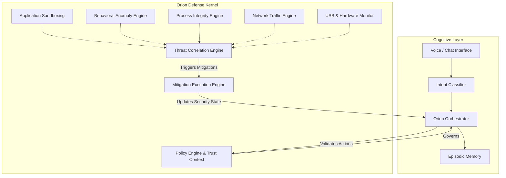

# ORION: Cognitive Host Defense & AI Orchestrator

## Overview

ORION is an advanced, cognitive AI assistant seamlessly integrated with a state-of-the-art **Endpoint Detection and Response (EDR)** and **Host-based Intrusion Prevention System (HIPS)** framework.

Traditional AI agents are designed purely for task execution. ORION flips this paradigm by acting as a proactive, policy-governed guardian of the host operating system. It leverages cognitive AI capabilities (Natural Language Processing, intent classification, episodic memory) not only to interact with users but to continuously monitor, analyze, and neutralize cyber threats in real-time.

## The Orion Defense Kernel

At the core of ORION's cybersecurity posture is the **Orion Defense Kernel**—a non-autonomous, highly explainable security layer. The Kernel operates deterministically alongside the AI, preventing unauthorized actions while actively hunting for anomalies.

### Security Architecture

## Core Cyber-Centric Capabilities

1. **Application Sandboxing & Execution Control**
   Untrusted executables and newly launched applications are observed within a controlled context. The kernel monitors file system modifications (e.g., changes to `/tmp`) and sudden network connections, scoring the behavior before granting full execution trust.

2. **Process Integrity & Behavioral Monitoring**
   The `ProcessIntegrityEngine` and `BehavioralAnomalyEngine` continuously analyze running processes. By establishing a baseline of normal host operations, ORION detects anomalous deviations indicative of malware injection, unauthorized privilege escalation, or tampering.

3. **Network Traffic Analysis**
   The `NetworkTrafficEngine` inspects inbound and outbound socket connections. It identifies suspicious data exfiltration attempts, command-and-control (C2) beacons, and non-standard protocol usage.

4. **Static Code Inspection**
   Before executing unfamiliar scripts or user-provided code, the `StaticCodeInspector` parses the Abstract Syntax Tree (AST). This allows ORION to identify potentially malicious payloads, obfuscation techniques, or unsafe operations at rest.

5. **Threat Correlation**
   Low-level indicators of compromise (IoCs) are rarely dangerous in isolation. The `ThreatCorrelationEngine` connects seemingly disparate events (e.g., a suspicious USB insertion followed by a sudden outbound network connection) to accurately identify sophisticated, multi-stage attacks.

6. **Policy Governance & Mitigation**
   ORION is bound by strict deterministic policies to ensure the AI does not inflict self-harm on the system. When the `ThreatCorrelationEngine` confirms an attack, the `MitigationPlanner` formulates a defense strategy (e.g., terminating processes, blacklisting IPs), which is then safely deployed by the `MitigationExecutionEngine`.

## Repository Structure

* `src/core/`: The cognitive brain of ORION (Orchestrator, Memory, Intent Classification).
* `src/security/`: The heart of the cyber-defense mechanisms (Defense Kernel, Mitigation Engines, Sensors, and Policies).
* `src/main/`: Application bootstrap, Socket.IO server, and entry points.

---
*Developed as a next-generation prototype for Cognitive Security and OS-level AI Guardians.*
